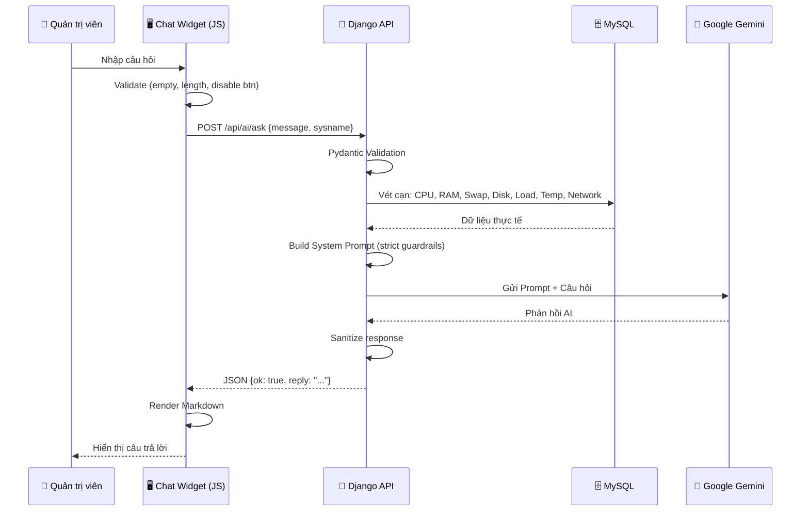

# ✅ AI DevOps Assistant — Ý Tưởng 1: HOÀN THÀNH 100%

## Tổng kết những gì đã làm

### Các file đã tạo mới
| File | Mô tả |
|------|--------|
| [ai_api.py](file:///d:/Project_Py/SNMPHealthMonitor/server_django/apps/metrics/ai_api.py) | **Backend API** — Logic chính: RAG Context Builder, System Prompt, gọi Gemini AI, xử lý toàn bộ edge cases |
| [ai-chatbot.css](file:///d:/Project_Py/SNMPHealthMonitor/server_django/static/css/ai-chatbot.css) | **Stylesheet** — Glassmorphism UI, dark mode, animations, responsive |
| [ai-chatbot.js](file:///d:/Project_Py/SNMPHealthMonitor/server_django/static/js/ai-chatbot.js) | **Frontend JS** — Chat widget, markdown rendering, anti-spam, error handling |

### Các file đã chỉnh sửa
| File | Thay đổi |
|------|----------|
| [urls.py](file:///d:/Project_Py/SNMPHealthMonitor/server_django/config/urls.py) | Import `ai_router` + đăng ký route `/api/ai/` |
| [base.html](file:///d:/Project_Py/SNMPHealthMonitor/server_django/templates/base.html) | Nhúng CSS + JS chatbot (cho trang Dashboard) |
| [layout.html](file:///d:/Project_Py/SNMPHealthMonitor/server_django/templates/layout.html) | Nhúng CSS + JS chatbot (cho trang File Manager, System, Audit) |
| [.env](file:///d:/Project_Py/SNMPHealthMonitor/server_django/.env) | Thêm `GEMINI_API_KEY=` |
| [requirements.txt](file:///d:/Project_Py/SNMPHealthMonitor/server_django/requirements.txt) | Thêm `google-generativeai>=0.8.0`, dọn dẹp trùng lặp |

---

## API Endpoints

| Method | URL | Chức năng |
|--------|-----|-----------|
| `POST` | `/api/ai/ask` | Chat với AI — truyền `message` và `sysname` |
| `GET` | `/api/ai/health-summary/{sysname}` | Auto-analyze sức khỏe thiết bị |

---

## Kiến trúc hoạt động



---

## Edge Cases đã xử lý

| # | Kịch bản | Backend | Frontend |
|---|----------|---------|----------|
| 1 | Tin nhắn rỗng | Pydantic reject | JS ignore silently |
| 2 | Tin nhắn quá dài (>500 ký tự) | Pydantic reject | Toast cảnh báo |
| 3 | Hỏi ngoài lề / Prompt injection | System Prompt từ chối lịch sự | — |
| 4 | AI bịa thông số (hallucination) | System Prompt rule #1: chỉ dùng data được cấp | — |
| 5 | Thiết bị offline / data cũ | Tự detect >5 phút → cảnh báo trong context | — |
| 6 | Device không tồn tại | Thông báo trong context | — |
| 7 | Thiếu API Key | Return error code `NO_API_KEY` | Hiện thông báo |
| 8 | API Key sai | Classify lỗi → `INVALID_API_KEY` | Hiện thông báo |
| 9 | Gemini timeout | Try-catch + classify lỗi | Hiện thông báo |
| 10 | Gemini hết quota | Classify lỗi → `QUOTA_EXCEEDED` | Hiện thông báo |
| 11 | Spam click liên tục | — | Disable button + input khi loading |
| 12 | XSS injection | — | `escapeHtml()` trước khi render |
| 13 | Response bị safety filter chặn | Check `response.candidates` | Thông báo lịch sự |
| 14 | Thư viện chưa cài | ImportError catch | Hiện hướng dẫn cài |

---

## Hướng dẫn chạy

> [!IMPORTANT]
> Bạn cần làm 2 việc trước khi chạy:

### 1. Cài thư viện
```bash
cd d:\Project_Py\SNMPHealthMonitor\server_django
pip install google-generativeai
```

### 2. Lấy API Key và dán vào `.env`
1. Vào https://aistudio.google.com/app/apikey
2. Bấm **Create API Key**
3. Copy key và dán vào file `.env`:
```
GEMINI_API_KEY=AIzaSy..........your_key_here
```

### 3. Chạy server
```bash
python manage.py runserver
```

---

## Giao diện Chatbot

- 🔵 **Nút chat nổi** (góc phải dưới) — animation pulse thu hút
- 💬 **Khung chat** glassmorphism khi bấm vào
- 🤖 **Welcome message** tự động
- ⚡ **Quick action buttons**: Tổng quan, CPU & RAM, Disk, Bất thường
- 🔍 **Nút Auto-Analyze**: AI tự động phân tích sức khỏe toàn bộ
- 🗑️ **Nút Clear**: Xóa lịch sử chat
- ⏳ **Typing indicator**: 3 chấm nhảy khi AI đang suy nghĩ
- 📝 **Markdown rendering**: Bold, italic, code, lists trong câu trả lời AI
